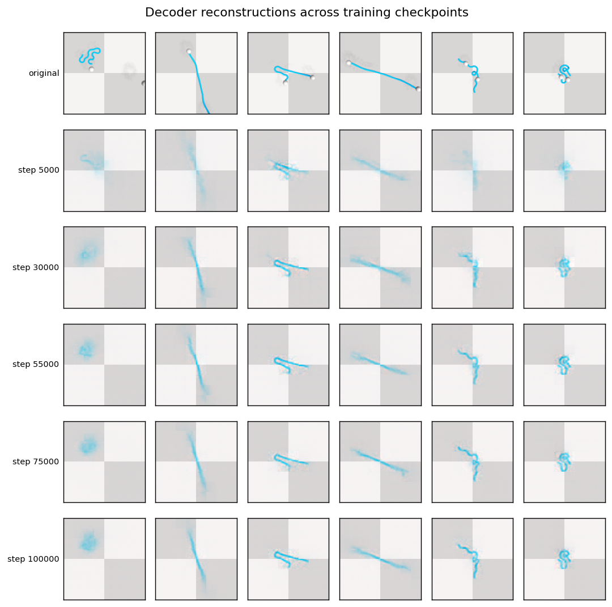

# Proprioception Fusion: Motivation, Evidence, and Design

> Why our latent world model needs explicit picker (proprioceptive) state, the
> diagnostic evidence that pinpointed the gap, and the architectural change to
> fix it. Data is already collected — this is a **retrain-only** change.

---

## 1. Symptom: planning underperforms

Receding-horizon latent MPC on RopeFlatten recovers only **~16–23% of the
expert-achievable improvement** (mean Δ = +0.06 vs expert Δ = +0.39), with a
**~20% success rate** (final normalized performance > 0.8). The planner
occasionally flattens the rope beautifully (best episodes reach ~0.98) but is
inconsistent: it works when the geometry happens to line up and fails
otherwise.

This pattern — high variance, occasional success, frequent failure — is the
signature of a planner that **can roll the rope forward in latent space but
cannot reliably reason about where its own grippers are.**

---

## 2. Diagnostic: is it the model or the planner?

Before changing anything, we verified whether the learned representation is
useful, by training a **decoder** (frozen encoder → image) to probe what the
192-dim planning latent encodes. A good reconstruction is conclusive evidence
the information is present; reconstruction quality *is* the information-content
measurement.

### 2.1 Conv decoder (DCGAN-style upsampler)


*Top row: original frames. Bottom row: reconstruction from the frozen planning
latent.* The rope's **position and coarse shape** are recovered (e.g. straight
diagonal rope → straight diagonal reconstruction), but the image is blurry and
the white picker spheres are absent.

### 2.2 Transformer decoder (LeWM-style cross-attention, paper App D)


*Top: originals. Bottom: reconstructions.* The stronger decoder recovers rope
**curvature, orientation, and position sharply** — confirming the latent
genuinely encodes rope geometry. **But the picker spheres (visible in several
originals) are still not reconstructed.**

### 2.3 Across training checkpoints



*Rows = training checkpoints (step 5000 → 100000), columns = the same fixed
frames.* Rope reconstruction sharpens as training progresses (the encoder
learns), while the pickers remain absent at **every** checkpoint — the gap is
structural, not a matter of undertraining.

> *(generate with `eval/decode_across_checkpoints.py`; see its header.)*

### 2.4 Verdict

| Information | In the planning latent? |
|---|---|
| Rope shape / position | ✅ strongly encoded (sharp reconstruction) |
| **Picker / proprioceptive state** | ❌ **not encoded** (pickers never reconstructed, even with a strong decoder) |

The decoder-weakness explanation is ruled out: a strong decoder reconstructs
the rope crisply but cannot place the pickers. **The latent lacks picker
state.** The model is fine for rope geometry; the gap is proprioception.

---

## 3. Root cause: why the encoder drops picker state

Two architectural facts make this the *expected* behavior of our current model:

1. **The encoder is pixels-only.** `proprio` (picker xyz + grip) is collected in
   our v3 schema and loaded by the dataset, but it is **never fed to the
   model** — `lewm_forward` uses only `pixels` and `action`. So picker state can
   only enter the latent if the encoder chooses to encode the small, low-contrast
   picker spheres from pixels.

2. **Picker motion is redundant with the action.** The predictor is conditioned
   on the action (`[dx, dy, dz, grip] × 2`) via AdaLN. Since the picker moves
   deterministically with the commanded action, the predictor can model picker
   dynamics from the action *without* the encoder encoding picker position. The
   SIGReg + prediction objective therefore gives the encoder **no incentive** to
   spend latent capacity on picker position — it is "explained away" by the
   action conditioning.

Net effect: the latent encodes what is *not* derivable from the action (rope
configuration) and discards what *is* (picker position).

---

## 4. Why this breaks planning specifically

Tracing what the MPC planner actually receives each replan:

```
plan(pixels_history, goal_emb, history_actions)
```

- **pixels_history → z_hist**: re-encoded each step, so the picker is in the
  image — but only weakly surfaced into the latent (per §2).
- **history_actions**: these are **deltas**, not absolute positions. Knowing the
  last few deltas does not tell the planner where the picker *is* without
  integrating from a known origin.
- **No explicit proprio** is provided to the planner or the model.

To flatten a rope the planner must move a picker *to* a rope endpoint, descend,
grip, and pull — which requires knowing the picker's position **relative to the
rope**. With picker state absent from the latent and only relative actions
available, the planner is effectively **planning grips blind**. This precisely
explains the inconsistent ~20% success: it works when the rope/picker geometry
happens to align with what the model can infer, and fails otherwise.

---

## 5. The fix: fuse proprio into the predictor conditioning

### 5.1 Where to fuse — and where NOT to

**Do NOT fuse proprio into the goal-matched latent `emb`.** The MPC goal is a
target *rope-shape image*; it has no meaningful target picker position. If
proprio were part of `emb`, goal-matching (`‖z_pred − z_goal‖²`) would also try
to drive the picker to whatever arbitrary position appears in the goal frame —
corrupting the objective.

**Fuse proprio into the predictor's conditioning instead**, alongside the
action. This cleanly separates the two roles:

| Quantity | Role |
|---|---|
| `emb` (pixel-only) | *what to match to the goal* — rope configuration |
| `proprio` (picker xyz + grip) | *what the dynamics model conditions on* — current picker grounding |

The predictor then conditions on `[action_embed ; proprio_embed]` via AdaLN, so
it has accurate, explicit picker state when rolling the latent forward — while
goal-matching stays purely about rope shape.

### 5.2 Architecture change (`training/model.py`)

```
proprio (B, T, 8)
      │
      ▼
 ProprioEmbedder (small MLP: 8 → D)           action (B, T, 8)
      │                                              │
      └──────────────┐                ┌──────────────┘
                     ▼                ▼
              cond = action_embed + proprio_embed   (or concat→proj to D)
                     │
                     ▼
              ARPredictor AdaLN-zero(cond)   ← unchanged otherwise
```

- Add a `ProprioEmbedder` (mirrors the existing action `Embedder`: per-step
  Conv1d + MLP, 8 → D).
- In `lewm_forward`, build the conditioning from action **and** proprio and pass
  it to the predictor. `batch["proprio"]` is already present (dataset provides
  it; currently ignored).
- `emb` (encoder output / projector) is **unchanged** — still pixel-only, still
  the goal-matched latent and the SIGReg target.

### 5.3 Eval-time change (`eval/run_mpc.py`, planner)

The planner already receives the current observation each replan, and the env
returns `proprio` in every `step_out`. We feed the **current proprio** into the
rollout's conditioning so the predictor is grounded in the actual picker state.
The goal cost is unchanged (terminal pixel-latent distance to the goal image).

---

## 6. Cost

| | |
|---|---|
| **Data recollection** | **None.** `proprio` is already in the v3 HDF5 (`/proprio`, picker xyz + grip), normalized by `/stats/proprio`, and returned by both dataset paths. |
| **Code** | ~30 lines in `model.py` (ProprioEmbedder + fuse), a few in `lewm_forward` / `train.py`, and the eval rollout supplying current proprio. |
| **Compute** | One retrain (ablation-scale: ~8 epochs on the full dataset, tens of minutes on H100 with `--gpu-cache`). |

---

## 7. Hypothesis and validation

**Hypothesis**: explicit picker grounding in the predictor conditioning will let
the planner reason about grips, raising the MPC success rate and the fraction of
expert-achievable improvement recovered, with lower variance across rope
configurations.

**Validation plan** (same protocol as the current results, for a clean
before/after):
1. Retrain with proprio fusion.
2. Re-run the imitate MPC eval (receding-horizon, goal-offset sweep) and compare
   **improvement Δ (final − start)** and **success rate** to the pixels-only
   model.
3. Optional: a linear probe `predictor-conditioning → picker xyz` to confirm
   picker state is now accessible (the quantitative analogue of the decoder
   figures above).

A clean before/after on the same metric is itself a strong result: it isolates
the contribution of proprioception to deformable-object planning — an
adaptation the LeWM paper deliberately omitted (it excluded proprio from
DINO-WM for a fair vision-only comparison), making this a meaningful,
domain-motivated extension.

---

## 8. Relation to prior work

The LeWM paper trains pixels-only and excludes proprioception (App C, for fair
comparison with DINO-WM). For *rigid-body* PushT this is sufficient. Our
diagnostic shows that for *deformable manipulation with abstract pickers*, the
picker state — cheap to provide, already collected — is exactly the missing
ingredient for reliable grip planning. Fusing it is a small, principled,
domain-specific adaptation, validated by the decoder evidence above.
