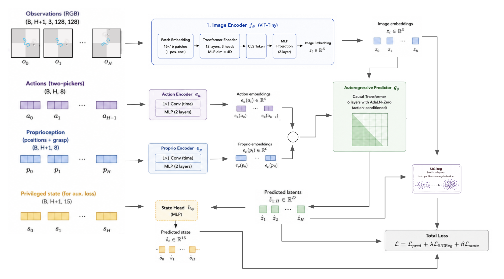
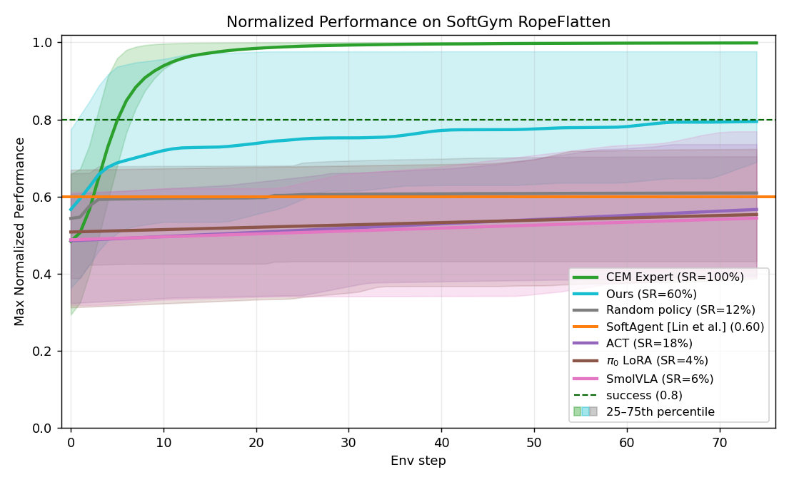
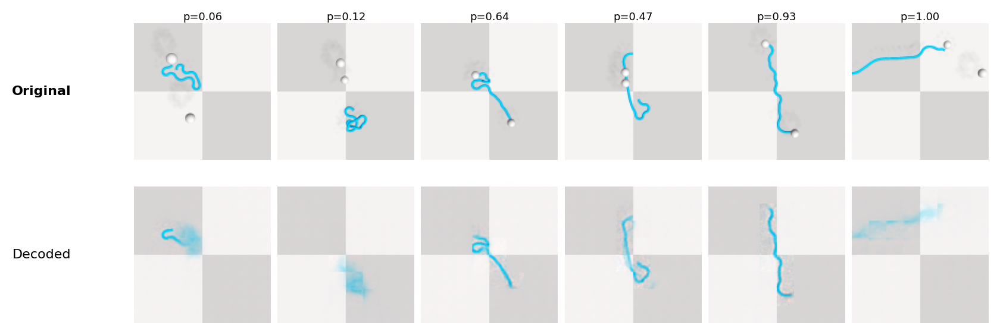
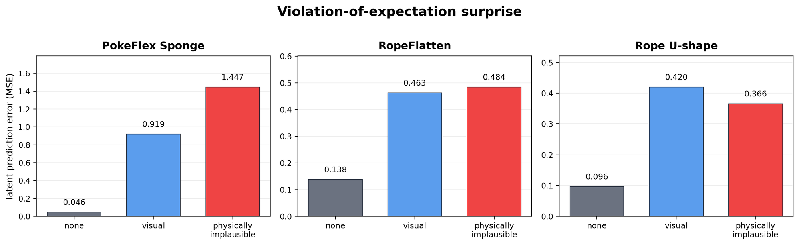

# Latent World Modeling for Deformable Object Manipulation

**Nikunj Parasar · Ethan Lai · Khush Lalchandani** — Stanford University, CS 231N (Spring 2026)

[**Paper (PDF)**](CS231N_Final_Report.pdf) · [**Poster (PDF)**](CS_231N_Poster.pdf)

A compact, action-conditioned JEPA world model for rope manipulation. We adapt the
[LeWorldModel](https://github.com/lucas-maes/le-wm) recipe to SoftGym `RopeFlatten`: an 18.6M-parameter
model learns rope dynamics in a 192-dim latent space from RGB, two-picker actions, and proprioception, trained
with next-latent prediction + SIGReg (no pixel reconstruction). A CEM planner then does model-predictive control
directly in latent space.

**LeWM-MPC reaches 60% task success on unseen rope configurations, outperforming ACT, SmolVLA, π0 LoRA, and
SoftGym's image-based RL baselines while being up to 150× smaller than the VLAs.**



## Results

Evaluated on 50 held-out SoftGym `RopeFlatten` episodes. Success = final normalized performance > 0.8.

| Policy | Params | Success rate | Mean final perf. | Per-step latency |
|---|---:|---:|---:|---:|
| **LeWM-MPC (ours)** | **18.6M** | **60%** | **0.848** | 821.6 ms |
| ACT | 52M | 18% | 0.542 | 25.7 ms |
| SmolVLA | 450M | 6% | 0.444 | 282.6 ms |
| π0 LoRA | 3B | 4% | 0.432 | 308.9 ms |
| SoftGym image RL (CURL-SAC, DrQ, PlaNet) | — | substantially lower (paper, Fig. 3) | — | — |

Our latency covers 9,000 candidate action sequences × 30 CEM iterations evaluated entirely in latent space per replan.

<p align="center"></p>

### What mattered (ablations)

Prediction MSE turned out to be a poor proxy for task success; models with near-identical MSE differed by 20+ points.

| Run | Change vs. final | Data | Pred MSE ↓ | Success ↑ |
|---|---|---|---:|---:|
| `mix19k_aux` | **final model** | 19k mixed | 0.0152 | **60%** |
| `mix19k_base` | − auxiliary state head | 19k mixed | 0.0168 | 46% |
| `mix19k_d384` | + capacity (D = 384) | 19k mixed | 0.0121 | 46% |
| `rope_cem_noaux` | CEM-only data, − aux | 4k expert only | 0.0188 | 38% |
| `rope_proprio_v1` | − aux, no CEM data | 15k | 0.0189 | 30% |
| `rope_full_mixed_v1` | − aux, − proprio, no CEM data | 15k | 0.0134 | 24% |
| `rope_red_rgb` | red pickers, − proprio | 15k | 0.0415 | 12% |

Two findings drove the final design: (1) mixing near-optimal oracle-CEM demonstrations with broad-coverage
random/heuristic data raised the ceiling more than model capacity did, and (2) an auxiliary head that regresses a
15-dim compact rope state from the latent during training (dropped at inference) lifted success from 46% to 60%
by keeping rope geometry in the representation.

### Latent decoding, harder tasks, and violation of expectation

<p align="center"></p>

A diagnostic decoder trained from frozen latents recovers rope extent, curvature, and endpoint layout, supporting
latent distance as a planning cost. On a harder **Rope U-shape** goal (curved target geometry), the same recipe
reaches 0.63 mean peak performance, with 3/10 rollouts holding the shape to the end. Violation-of-expectation tests
on RopeFlatten, U-shape, and the real-robot **PokeFlex Sponge** dataset show the model assigns 3–30× higher
surprise to visually or physically implausible futures than to true ones.

<p align="center"></p>

## Method in brief

- **Encoder** `f_θ`: ViT-Tiny-style, 128×128 → 64 patch tokens + CLS, 12 layers / 3 heads, CLS projected by a 2-layer MLP to `z_t ∈ R^192`.
- **Predictor** `g_φ`: 6-block causal transformer with AdaLN-zero conditioning on `c_t = e_a(a_t) + e_p(p_t)`; predicts `ẑ_{t+1}` from a history of 3 latents.
- **Loss**: `L = L_pred + λ·L_SIGReg + β·L_state` with λ = 0.09, β = 0.5. SIGReg (1024 random projections) pushes latents toward an isotropic Gaussian to prevent collapse.
- **Training**: 100k steps, batch 128, AdamW 5e-5, bf16, single H100. No validation split; evaluation is on unseen configurations.
- **Planning**: frozen model; CEM over normalized actions, horizon 5, 300 samples / 30 elites / 30 iterations, cost `‖ẑ_{t+K} − z_goal‖²`; replan after every executed segment with re-encoded real observations.

## Dataset

19,031 `RopeFlatten` episodes (1.45M frames), 75 control steps each, 128×128 top-down RGB + 8-dim two-picker
action + 8-dim proprioception + 15-dim privileged state (auxiliary loss only).

| Source | Episodes | Mean final perf. | Role |
|---|---:|---:|---|
| Oracle CEM (privileged dynamics) | 4,031 | 0.994 | near-optimal demonstrations |
| Geometric solver (scripted) | 5,000 | 0.905 | clean task completions |
| Random exploration | 5,000 | 0.409 | collisions, missed grasps |
| Manipulative heuristic | 5,000 | 0.448 | curls, folds, interior grasps |

Oracle CEM collection ran across 3 nodes / 24 GPUs / 144 vCPUs. Formats are documented in
[`ai_docs/DATA_FORMAT.md`](ai_docs/DATA_FORMAT.md). The dataset itself is not in this repo (too large); open an issue if you want it.

## Repository layout

```
training/      LeWM world model: model.py, dataset.py, train.py, ablation sweeps, diagnostic decoder
eval/          Latent-MPC: mpc_runner.py, CEM solvers, latent cost, goal sampling, SoftGym env client
baselines/     ACT / SmolVLA (LeRobot) and π0 LoRA (openpi) training + eval, data conversion, policy server
simulation/    SoftGym + PyFlex + SoftAgent (vendored), Docker, trajectory collection scripts
ai_docs/       Architecture notes and data-format spec
docs/figures/  Figures from the paper
```

## Quickstart

Training and evaluation run in a modern Python 3.10+ / PyTorch environment; the simulator runs in a separate
Docker container (Python 3.6, see [`simulation/README.md`](simulation/README.md)).

```bash
# 1. Environment for training / planning
python3 -m venv .venv && source .venv/bin/activate
pip install -r training/requirements.txt

# 2. Train the final world-model configuration
python training/train.py \
  --data data/rope_mix19k.h5 --steps 100000 --batch-size 128 \
  --embed-dim 192 --history-size 3 --predictor-depth 6 \
  --use-proprio --sigreg-weight 0.09 --aux-state-weight 0.5 \
  --run-name mix19k_aux

# 3. Closed-loop latent MPC in SoftGym (needs the simulator container running)
python eval/mpc_runner.py \
  --ckpt training/runs/mix19k_aux/ckpt_final.pt \
  --n-episodes 50 --horizon 5 --cem-samples 300 --cem-iters 30 --cem-topk 30

# 4. Baselines
bash baselines/scripts/train_act.sh        # ACT via LeRobot
bash baselines/scripts/train_smolvla.sh    # SmolVLA via LeRobot
bash baselines/pi0/train_pi0_lora_softgym_rope.sh   # π0 LoRA via openpi
```

`training/run_ablations.sh` reproduces the sweep in the ablation table; `training/train_decoder.py` trains the
diagnostic latent decoder.

## Contributions

Joint work by Nikunj Parasar, Ethan Lai, and Khush Lalchandani across data collection, world-model training,
baselines, evaluation, and writing; the paper's Section 7 has the detailed contribution statement.

## Acknowledgements

This project builds on [LeWorldModel](https://github.com/lucas-maes/le-wm), [stable-worldmodel](https://github.com/galilai-group/stable-worldmodel),
[SoftGym](https://github.com/Xingyu-Lin/softgym) / [SoftAgent](https://github.com/Xingyu-Lin/softagent) (NVIDIA FleX, PyFleX),
[LeRobot](https://github.com/huggingface/lerobot) (ACT, SmolVLA), and [openpi](https://github.com/Physical-Intelligence/openpi) (π0).
See [ATTRIBUTION.md](ATTRIBUTION.md) for the full list and licenses.

## Citation

```bibtex
@techreport{parasar2026latentrope,
  title  = {Latent World Modeling for Deformable Object Manipulation},
  author = {Parasar, Nikunj and Lai, Ethan and Lalchandani, Khush},
  year   = {2026},
  institution = {Stanford University, CS 231N}
}
```
